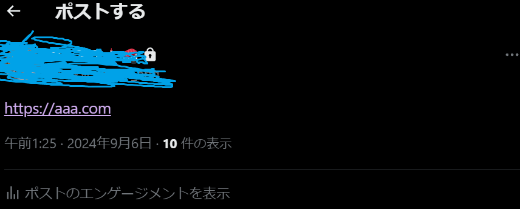

Convert text like this in Twitter. And also make it clickable.  
  
  

### How to use
1. Install tampermonkey  
This script is work on Tampermonkey.  
(ref: https://chromewebstore.google.com/detail/dhdgffkkebhmkfjojejmpbldmpobfkfo)   

3. Install  
link:  
https://github.com/sushigadaisuki/twitter_ttp2http/raw/main/twitter_ttp2http.user.js  
